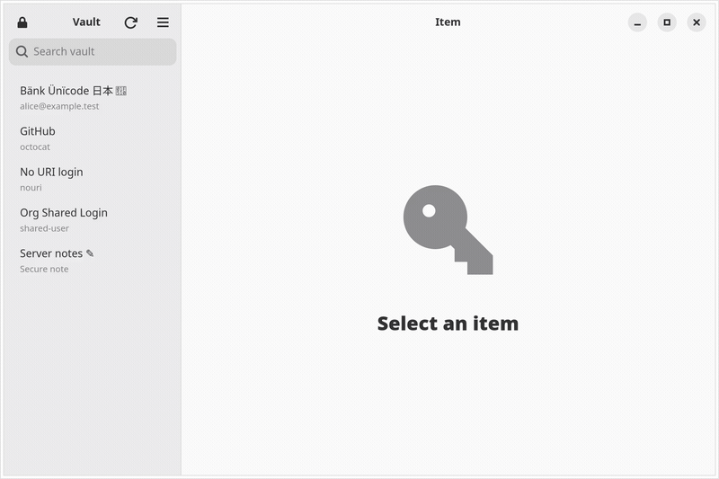

# Sangward

A fast, native Linux desktop app for your **self-hosted password vault**. It
works with Vaultwarden and self-hosted Bitwarden servers.

Sign in with your email and master password, then search your vault and copy
usernames, passwords and 2FA codes. Copied secrets clear themselves from the
clipboard after 30 seconds. Sangward sits in your tray and locks itself when
you step away.

Sangward is an independent project. It is not affiliated with Bitwarden Inc.



## Why is it called Sangward?

The name is two words put together:

- ***sang*** is from the Tibetan *gsang ba*, meaning "secret".
- ***ward*** is English. It is a ridge inside a lock that only the right key
  can pass, and it also means "to guard or protect".

Put together, it means roughly "secret, guarded".

## Features

- Sign in to your own server with email and master password, plus
  authenticator-app (TOTP) two-factor login.
- Search your Logins and Secure Notes. Items shared with you through an
  organization show up too.
- Copy a username, password or current 2FA code with one click. The
  clipboard clears after 30 seconds if it still holds what Sangward copied.
- Show a password on screen only when you ask to.
- Locks after 15 minutes of inactivity. After that, unlocking needs only your
  master password.
- A tray icon with Open, Lock, Sync and Quit.
- A full command-line tool, `sangward`, for terminals and scripts.
- Handles vaults with thousands of items without slowing down.

Sangward currently shows your vault without editing it. Adding and editing
items, browser autofill, biometric unlock, Sends and attachments aren't
supported yet. Use your server's web vault for those.

## Requirements

- Linux with GTK 4.14+ and libadwaita 1.5+.
- A Vaultwarden or self-hosted Bitwarden server reachable over **HTTPS**. Its
  certificate must be trusted by your system. If you use a private CA, add it
  to the system trust store.
- Recommended: a keyring that supports Secret Service, such as GNOME Keyring,
  KWallet or KeePassXC. Sangward keeps your sign-in there so it can sync
  again after a restart. Without one, unlocking still works, but after a
  restart you'll have to sign in again before you can sync.
- For the tray icon: KDE and most other desktops work as-is. **GNOME needs
  the "AppIndicator and KStatusNotifierItem Support" extension.**

## Install

There are no packages yet, so you'll need to build Sangward from source with
Rust and the GTK 4/libadwaita development files:

```sh
cargo build --release
install -Dm755 target/release/sangward-gtk target/release/sangward \
  target/release/sangward-agent -t ~/.local/bin/
install -Dm644 packaging/dev.sangward.Sangward.desktop \
  ~/.local/share/applications/dev.sangward.Sangward.desktop
install -Dm644 packaging/dev.sangward.Sangward.svg \
  ~/.local/share/icons/hicolor/scalable/apps/dev.sangward.Sangward.svg
update-desktop-database ~/.local/share/applications
```

Keep all three programs in the same directory or on your `PATH`.
`sangward-gtk` and `sangward` start `sangward-agent` themselves.

Arch Linux packages (AUR recipes for both a source build and the prebuilt
release) live in [`packaging/`](packaging/).

## Using the app

1. Run `sangward-gtk`.
2. Enter your server address (for example `https://vault.example.com`), your
   email and your master password. If you have two-factor login turned on,
   you'll be asked for a code next.
3. Search for an item, select it, and use the copy buttons. The reveal button
   shows the password on screen.

Lock the vault from the padlock button or the tray. The sync button fetches
changes you've made in other apps.

Closing the window hides Sangward to the tray. If your desktop has no tray,
closing the window quits instead. Quitting locks your vault and stops the
background agent. If you'd rather keep it running in the background (it still
auto-locks), tick **Keep agent running after quit** in the menu.

## Using the command line

```sh
sangward login --server https://vault.example.com --email you@example.com
sangward list github                 # search by name, username or website
sangward copy GitHub                 # copy the password; clears after 30 s
sangward copy GitHub --field totp    # or --field username
sangward get GitHub --field username # print a field instead of copying it
sangward lock
sangward unlock                      # master password only
sangward sync
sangward status
sangward auto-lock 600               # change the auto-lock timeout (seconds)
sangward logout                      # sign out and remove the local copy
```

`sangward --help` and `sangward <command> --help` list every option.

Sangward never accepts passwords as command-line arguments, because other
programs on your system can read those. It asks for them at a prompt
instead. In scripts, use `--password-stdin` or `--password-env VAR`.

If your server keeps its identity and API services at separate addresses, add
`--identity-url` and `--api-url` to `login`.

## Where Sangward keeps your data

| What | Where |
|---|---|
| Encrypted copy of your vault | `~/.local/share/sangward/` |
| Settings (server address, email) | `~/.config/sangward/settings.json` |
| Sign-in token | Your system keyring |

The local vault copy stays encrypted with your master password, just like on
the server. Your master password is never saved. `sangward logout` removes
the local copy and the keyring entry.

## Security

Your vault stays encrypted in memory while Sangward is running. Only the
field you ask for is decrypted, at the moment you ask for it. A separate
background process, `sangward-agent`, holds the keys. It only talks to
programs running as your user, and it wipes the keys when the vault locks.

[SECURITY.md](SECURITY.md) covers what Sangward can't protect you from. The
security model is explained in more detail in
[DEVELOPMENT.md](DEVELOPMENT.md#security-model).

## Contributing

[DEVELOPMENT.md](DEVELOPMENT.md) covers the architecture, the dev
environment and the test suite. [DECISIONS.md](DECISIONS.md) records the
design decisions and the reasons behind them.

## License

GPL-3.0-or-later.
